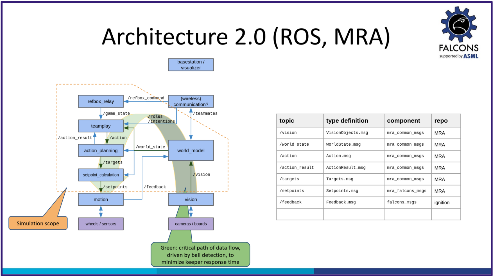

# MRA

MRA (Robocup MSL Reference Architecture).

This repository contains a set of ROS2 components and common datatypes (messages).
It facilitates reuse and code sharing within the Robocup MSL league, by focusing on interface definitions between components.

In particular, in case a team decides a component can be upgraded by using one from another team, then simply replace the ROS node reference in launch files.

# Architecture

# Integration

Basic setup using `git submodule`:
1. in a parent MSL team git repository, add this repo as a sub-module
2. ROS build tooling `colcon` will discover the components automatically
3. in parent (launch) scripting, refer to the nodes to be used

Alternative setup using `pixi`: see `pixi.toml`.

# History

Initial MRA version was using protobuf, not ROS2. The history can be found in a branch `mra_with_protobuf`.

