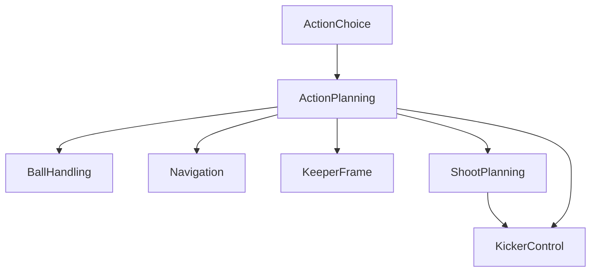

# ActionPlanning Component

## Overview

The `ActionPlanning` component provides a set of predefined actions that the `ActionChoice` component can select to direct robot behavior in a RoboCup match. It decomposes these high-level actions into basic movement commands, kicker settings, and ball-handling setpoints for processing by the robot's peripheral systems. Each action is evaluated every tick, returning a status: `PASSED`, `FAILED`, or `RUNNING`.

## Scope and Context

The `ActionPlanning` component covers a broad range of soccer-specific actions, each defined to achieve a particular objective on the field. Below is a list of available actions:

- **IDLE:** Idle, no action.
- **STOP:** Stop the robot (actively).
- **MOVE:** Navigate to a specified coordinate in the Field Coordinate System (FCS).
- **DRIBBLE:** Like `MOVE`, but with ball control, including small kicks.
- **DASH:** Move in a specified direction in the Robot Coordinate System (RCS).
- **KICK:** Kick the ball immediately..
- **PASS:** Aim and kick towards a target (typically a teammate) in FCS.
- **SHOOT:** Aim and kick towards a target (typically the goal) in FCS, maximizing ball velocity.
- **LOB:** Similar to `SHOOT`, but designed to maximize ball trajectory height.
- **GETBALL:** Retrieve the ball, potentially involving catching, interception or sprinting.
- **CATCH:** Intercept the ball using a basic strafing motion (previously known as `INTERCEPT`).
- **SHIELD:** Maintain ball control while rotating away from an opponent.
- **TACKLE:** Engage opponent having the ball, trying to dislodge it.
- **KEEPER:** Act as goal keeper.
- **BUMP:** Redirect the ball towards a target using a head or flat surface (a.k.a. `TIP-IN`).
- **PARK:** Move the robot to a designated parking position.
- **PREPARE:** Move the robot safely into the field, typically from the Technical Team Area (TTA).
- **ALIVE:** Prove to the referee that the robot is able to play.

### Out of scope

Note: it has been decided to leave some actions out of scope, instead handle them at the `ActionChoice` level, because of the use of heightmaps. Examples:
- **DEFEND:** Defend an opponent. (Using heightmaps, a `MOVE` target is calculated.)
- **CLEAR:** Clear the ball away from own goal. (Can use `LOB` instead.)

### Context diagram

TODO: link to main MRA diagram.

### Input and Output Flow

- **Input:** Action choices are provided by the `ActionChoice` / `Teamplay` module. These inputs should be relatively stable to ensure consistent behavior. `WorldModel` provides `WorldState` input.
- **Output:** The setpoints generated by `ActionPlanning` are dispatched to the actuation components.

## Interface Details

For details on the communication interfaces, refer to the following files:

- **Input:** [Input.proto](interface/Input.proto)
- **Output:** [Output.proto](interface/Output.proto)
- **Configuration Parameters:** [DefaultParams.json](interface/DefaultParams.json) and [Params.proto](interface/Params.proto)

## Design Notes

- The `ActionPlanning` component leverages MRA subcomponents for flexibility and reusability.
- Execution architecture: the robot should call this action at some frequency of say 30Hz.
- Actions have specific parameters, state, diagnostics data.
- Actions are logged in `.bin` files upon completion, including all intermediate data and the final result. This is essential for post-match analysis and debugging.

## Tooling and Extensions

### Proposed Tools:
1. **Python Keeper GUI:** Generalize the existing python keeper GUI to illustrate action implementations based on a general world state and action-specific parameters.
2. **Post-Match Analysis Tools:**
   - A tracing timeline to review the sequence of actions, their results, and pass/fail statistics using MRA tracing data.
   - A Python tool to plot action `.bin` files, allowing for in-depth post-mortem analysis.

