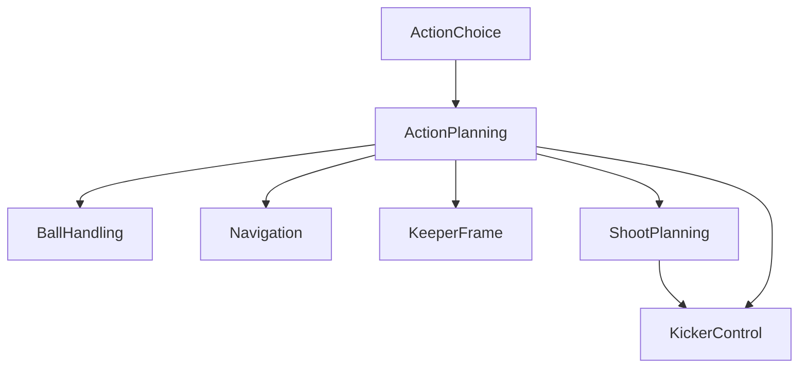

# ActionPlanning Component

## Overview

The `ActionPlanning` component provides a set of predefined actions that the `ActionChoice` component can select to direct robot behavior in a RoboCup match. It decomposes these high-level actions into basic movement commands, kicker settings, and ball-handling setpoints for processing by the robot's peripheral systems. Each action is evaluated every tick, returning a status: `PASSED`, `FAILED`, or `RUNNING`.

## Scope and Context

The `ActionPlanning` component covers a broad range of soccer-specific actions, each defined to achieve a particular objective on the field. Below is a list of available actions:

- **STOP:** Cease all robot movement.
- **MOVE:** Navigate to a specified coordinate in the Field Coordinate System (FCS).
- **DRIBBLE:** Like `MOVE`, but with ball control, including small kicks.
- **DASH:** Move in a specified direction in the Robot Coordinate System (RCS).
- **KICK:** Execute a straightforward kick without aiming.
- **PASS:** Aim and kick towards a target (typically a teammate) in FCS.
- **SHOOT:** Aim and kick towards a goal in FCS, maximizing ball velocity.
- **LOB:** Similar to `SHOOT`, but designed to maximize ball trajectory height.
- **GETBALL:** Retrieve the ball, potentially involving catching, interception or sprinting.
- **CATCH:** Intercept the ball using a basic strafing motion (previously known as `INTERCEPT`).
- **SHIELD:** Maintain ball control while rotating away from an opponent.
- **TACKLE:** Engage opponent having the ball, trying to dislodge it.
- **KEEPER:** Perform goalkeeping tasks.
- **BUMP:** Redirect the ball towards a target using a head or flat surface (a.k.a. `TIP-IN`).
- **PARK:** Move the robot to a designated parking position.
- **PREPARE:** Move the robot safely into the field, typically from the Technical Team Area (TTA).
- **ALIVE:** Prove to the referee that the robot is able to play.

### Context diagram

TODO: link to main MRA diagram.

### Input and Output Flow

- **Input:** Action choices are provided by the `ActionChoice` module. These inputs should be relatively stable to ensure consistent behavior.
- **Output:** The setpoints generated by `ActionPlanning` are dispatched to the control components.

### Action Effects

This table shows the effects an action may have.
For some actions, the ballhandling setpoint is simply relayed from input, these are marked `r`.
An `i` at the KickerControl column denotes implicit effect, as ShootPlanning is basically a calculator for kicker setpoints.

| Action   | BH | Shoot | Kick | Nav | KF | SubComponent                        | Notes              |
|----------|----|-------|------|-----|----|-------------------------------------|--------------------|
| STOP     | r  |       |      | x   |    | [action_stop](../action_stop)       |                    |
| MOVE     | r  |       |      | x   |    | [action_move](../action_move)       |                    |
| DRIBBLE  | x  |       | x    | x   |    | [TODO](../action_dribble)           |                    |
| DASH     | r  |       |      | x   |    | [TODO](../action_dash)              |                    |
| KICK     | x  |       | x    |     |    | [TODO](../action_kick)              |                    |
| PASS     | x  | x     | i    | x   |    | [action_aimed_kick](../action_aimed_kick) | specific tuning |
| SHOOT    | x  | x     | i    | x   |    | [action_aimed_kick](../action_aimed_kick) | specific tuning |
| LOB      | x  | x     | i    | x   |    | [TODO](../action_lob)               |                    |
| GETBALL  | x  |       |      | x   |    | [TODO](../action_getball)           | may call CATCH     |
| CATCH    |    |       |      | x   |    | [TODO](../action_catch)             |                    |
| SHIELD   | x  |       |      | x   |    | [TODO](../action_shield)            |                    |
| TACKLE   |    |       |      | x   |    | [TODO](../action_tackle)            |                    |
| KEEPER   |    |       |      | x   | x  | [TODO](../action_keeper)            |                    |
| BUMP     |    |       |      | x   |    | [TODO](../action_bump)              |                    |
| PARK     |    |       |      | x   |    | [action_park](../action_park)       |                    |
| PREPARE  |    |       |      | x   |    | [TODO](../action_prepare)           |                    |
| ALIVE    |    |       |      | x   |    | RobotSports [prove_is_alive](../../robotsports/prove_is_alive) | |

## Interface Details

For details on the communication interfaces, refer to the following files:

- **Input:** [Input.proto](interface/Input.proto)
- **Output:** [Output.proto](interface/Output.proto)
- **Configuration Parameters:** [DefaultParams.json](interface/DefaultParams.json) and [Params.proto](interface/Params.proto)

## Design Notes

- The `ActionPlanning` component leverages MRA subcomponents for flexibility and reusability.
- Execution architecture: the robot should call this action at some frequency of say 30Hz.
- Actions have specific parameters, state, diagnostics data.
- Actions are logged in `.bin` files upon completion, including all intermediate data and the final result. This is essential for post-match analysis and debugging.

## Tooling and Extensions

### Proposed Tools:
1. **Python Keeper GUI:** Generalize the existing keeper GUI (from `#JEFF`) to illustrate action implementations based on a general world state and action-specific parameters.
2. **Post-Match Analysis Tools:**
   - A tracing timeline to review the sequence of actions, their results, and pass/fail statistics using MRA tracing data.
   - A Python tool to plot action `.bin` files, allowing for in-depth post-mortem analysis.

