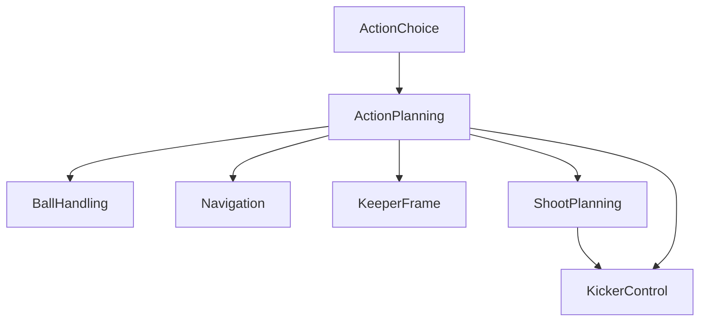

# ActionPlanning Component

## Overview

The `ActionPlanning` component provides a set of predefined actions that the `ActionChoice` component can select to direct robot behavior in a RoboCup match. It decomposes these high-level actions into actuator setpoints: movement target, kicker settings, and ball-handling setpoints for processing by the robot's peripheral systems. At every tick, given action is evaluated, returning a status: `PASSED`, `FAILED`, or `RUNNING`.

## Scope and Context

The `ActionPlanning` component covers a broad range of soccer-specific actions, each defined to achieve a particular objective on the field. Below is a list of available actions:

- **IDLE:** Idle, no action.
- **STOP:** Stop the robot (actively braking).
- **MOVE:** Navigate to a specified coordinate in the Field Coordinate System (FCS).
- **DRIBBLE:** Like `MOVE`, but with ball control, including small kicks. (Not yet implemented!)
- **DASH:** Move in a specified direction in the Robot Coordinate System (RCS). (Not yet implemented!)
- **KICK:** Kick the ball immediately. (Not yet implemented!)
- **PASS:** Aim and kick towards a target (typically a teammate) in FCS.
- **SHOOT:** Aim and kick towards a target (typically the goal) in FCS, maximizing ball velocity.
- **LOB:** Similar to `SHOOT`, but designed to maximize ball trajectory height. (Not yet implemented!)
- **GETBALL:** Retrieve the ball, potentially involving catching, stealing, interception or sprinting.
- **CATCHBALL:** Intercept the ball using a basic strafing motion (previously known as `INTERCEPT`).
- **SHIELD:** Maintain ball control while rotating away from an opponent. (Not yet implemented!)
- **TACKLE:** Engage opponent having the ball, trying to dislodge it. (Not yet implemented!)
- **KEEPER:** Act as goal keeper.
- **BUMP:** Redirect the ball towards a target using a head or flat surface (a.k.a. `TIP-IN`). (Not yet implemented!)
- **PARK:** Move the robot to a designated parking position.
- **PREPARE:** Move the robot safely into the field, typically from the Technical Team Area (TTA). (Not yet implemented!)
- **ALIVE:** Prove to the referee that the robot is able to play. (Not yet implemented!)

### Out of scope

Note: it has been decided to leave some actions out of scope, instead handle them at the `ActionChoice` level, because of the use of heightmaps. Examples:
- **DEFEND:** Defend an opponent. (Using heightmaps, a `MOVE` target is calculated.)
- **CLEAR:** Clear the ball away from own goal. (Can use `LOB` instead.)

Responsibilities currently out of scope:

* obstacle avoidance: this is left for Navigation, so the movement target is considered 'unsafe'
* shoot setpoint calculation: this is left for ShootPlanning

### Context diagram

TODO: link to main MRA diagram.
TODO: reconsider responsibilities to reduce "multiple captain" situations (fold ShootPlanning and Navigation into ActionPlanning?)

### Input and Output Flow

- **Input:** Action choices are provided by the `ActionChoice` / `Teamplay` module. These inputs should be relatively stable to ensure consistent behavior. `WorldModel` provides `WorldState` input.
- **Output:** The setpoints generated by `ActionPlanning` are dispatched to the actuation components.

Each action has its own semantics on `PASSED` / `FAILED`. For example, `GETBALL` fails when there is no ball in sight.
What all actions have in common, is that `RUNNING` generally means that more ticks are needed to come to a `PASSED` or `FAILED` result.
When an action fails, then a string at diagnostics field `verdict` explains why.

## Interface Details

For details on the communication interfaces, refer to the following files:

- **Input:** [Input.proto](interface/Input.proto)
- **Output:** [Output.proto](interface/Output.proto)
- **Configuration Parameters:** [DefaultParams.json](interface/DefaultParams.json) and [Params.proto](interface/Params.proto)

## Design Notes

- The `ActionPlanning` component leverages MRA subcomponents for flexibility and reusability.
- Execution architecture: the robot should call this action at some frequency of say 30Hz.
- Actions have specific parameters, state, diagnostics data.
- Actions are logged in `.bin` files upon completion, including all intermediate data and the final result. This is essential for post-match analysis and debugging.

## Tooling and Extensions

The tool `plot.py` can take an action `.bin` file, print some basic info and draw the situation at any sample. Use left and right arrows to browse through samples. This is useful to investigate failed actions after a match.

TODO: screenshot

