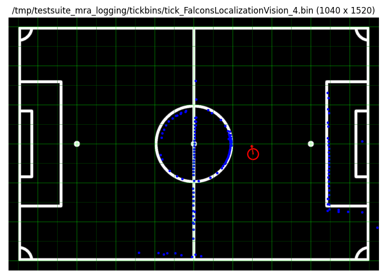
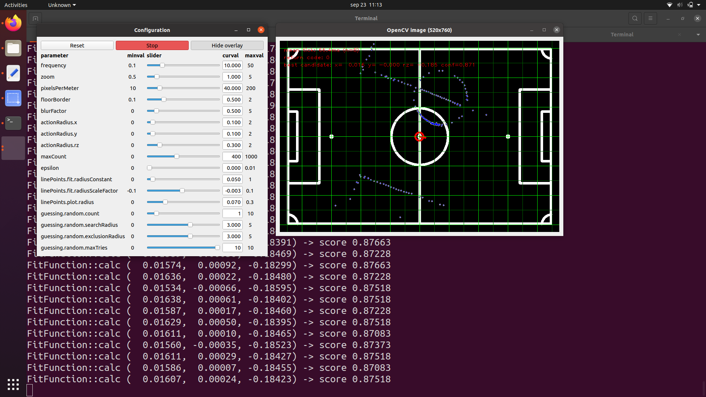

# Summary

LocalizationVision is responsible for determining location candidate(s) in field coordinate system (FCS) based on observed landmarks (typically white pixels) in robot coordinate system (RCS).

It uses the Simplex Downhill solver from `opencv`.

# Status

Basics are mostly there, interface is finished, implementation is not yet complete. Remaining work:
* port more tricks from Andre's code (mostly related to the confidence heuristic)
* integrate on Falcons robot, compare new against existing, prove it's working
* squeeze milliseconds

# Scope and context

This component covers **only part 2** of a three-step algorithm / dataflow related to self-localization.

1. perception: detect landmarks
2. determine candidate location(s) based on the landmarks
3. fuse candidate location(s) with odometry from the wheels to produce accurate robot location and velocity

Step 1 can be done with either systems like YOLO, or more straightforward image processing. (Not yet in MRA.)

Step 2 is implemented in this component. It takes the detected landmarks in RCS (typically detected white line pixels), filtered, already transformed from camera pixels coordinates. Its output is intended to be passed to LocalizationWorldModel for fusion with other sensor data.

Step 3 is implemented in LocalizationWorldModel sub-component, which applies the candidate locations as drift control w.r.t. the odometry, while also correcting for vision latency. (A Kalman filter could be used.)

# Interface details

See [Input.proto](interface/Input.proto) and [Output.proto](interface/Output.proto).

The configuration [Params.proto](interface/Params.proto) is two-fold:
1. the [official MSL field specification](https://msl.robocup.org/wp-content/uploads/2023/01/Rulebook_MSL2023_v24.1.pdf#section.1.1) (`A=22`, `B=14` etc) is used to generate a set of shapes
2. optional free shapes, for instance to write out the field from the Ambition Challenge, or to use 4 pylons / goalposts

The intent of this configuration design is to allow more general floors to use than only the MSL field. The MSL roadmap states the ability to **play anywhere**, which may be an indoor footsal field, or outside concrete floor with only two goals.

Note that teams tend to borrow each others field measurements using the definitions in [1] when calibrating for a new venue. It hardly makes sense for all of us to re-measure the same field ;).

# Design

Use the opencv Simplex Downhill solver to **fit** location candidates from the observed landmarks.

Add some randomness to prevent getting stuck in a sub-optimal location.

Use current location with latest odometry as best guess, to minimize the time needed for the fit algorithm to converge.

Includes a little python tool to plot field (serialized `CvMatProto`): `plot.py`.

# Demo

## plot.py

After having run the test suite:

`bazel run //components/falcons/localization_vision/test:plot /tmp/testsuite_mra_logging/tickbins/tick_FalconsLocalizationVision_4.bin`

## tune.py

Run tuning tool (sliders are automatically derived from `Params.proto`):

`bazel run //components/falcons/localization_vision/test:tune /tmp/testsuite_mra_logging/tickbins/tick_FalconsLocalizationVision_0.bin`

